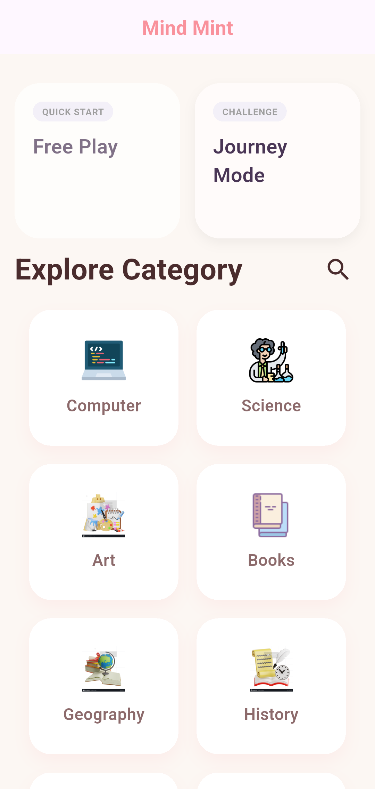
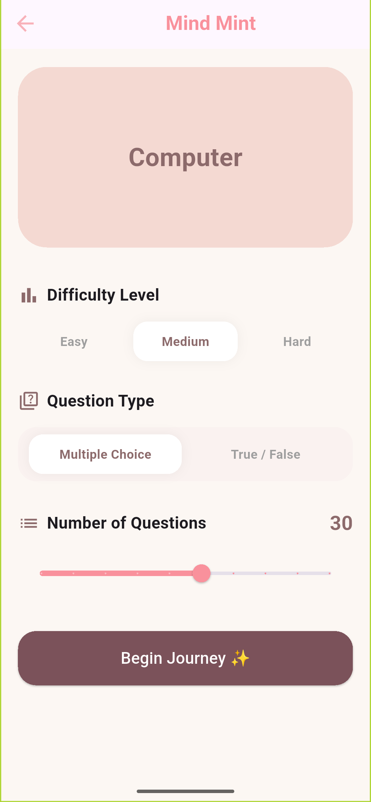
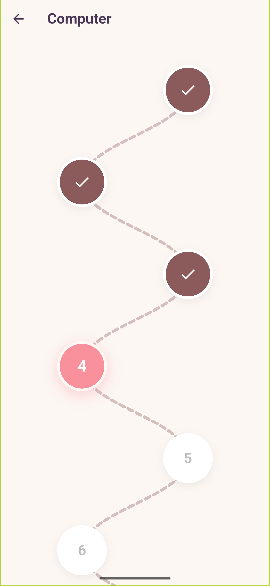

#  Mind Mint

Mind Mint is a professional **Flutter** application designed to gamify the learning experience. It leverages a robust architecture to provide users with dynamic quizzes, offline progress tracking, and a smooth, modern interface.

---

##  Key Features
- **Dynamic Quiz Engine:** Real-time data fetching from **REST APIs** (OpenTDB).
- **Offline-First Experience:** Seamless access to user progress and history without an active internet connection.
- **Smart Categorization:** Diversified topics with high-quality illustrations from **Icons8**.
- **Interactive Challenges:** Performance-based progression through Easy, Medium, and Hard levels.

---

##  Technical Architecture & Tools

###  State Management
- **Cubit (Bloc):** Implemented to ensure a predictable state, separating business logic from the UI for better scalability and testing.

###  Data Persistence (Local Storage)
- **Hive:** Utilized as the primary **NoSQL local database** to handle:
  - Storing user quiz history and high scores.
  - Tracking unlocked levels and achievement progress.
  - Ensuring fast data retrieval with a zero-boilerplate approach.

###  Networking
- **Dio:** Used for efficient HTTP requests, interceptors, and handling API communication with the OpenTDB service.

---

## 📱 Screenshots

<table width="100%">
  <tr>
    <td width="33.3%" align="center">
      <b>Dual-Mode Home Screen</b>  
      
    </td>
    <td width="33.3%" align="center">
      <b>Category Insights & Modes</b>  
      
    </td>
    <td width="33.3%" align="center">
      <b>Journey Level Map</b>  
      
    </td>
  </tr>
</table>

